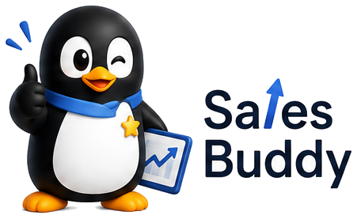
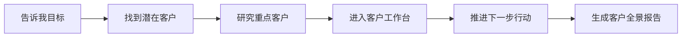
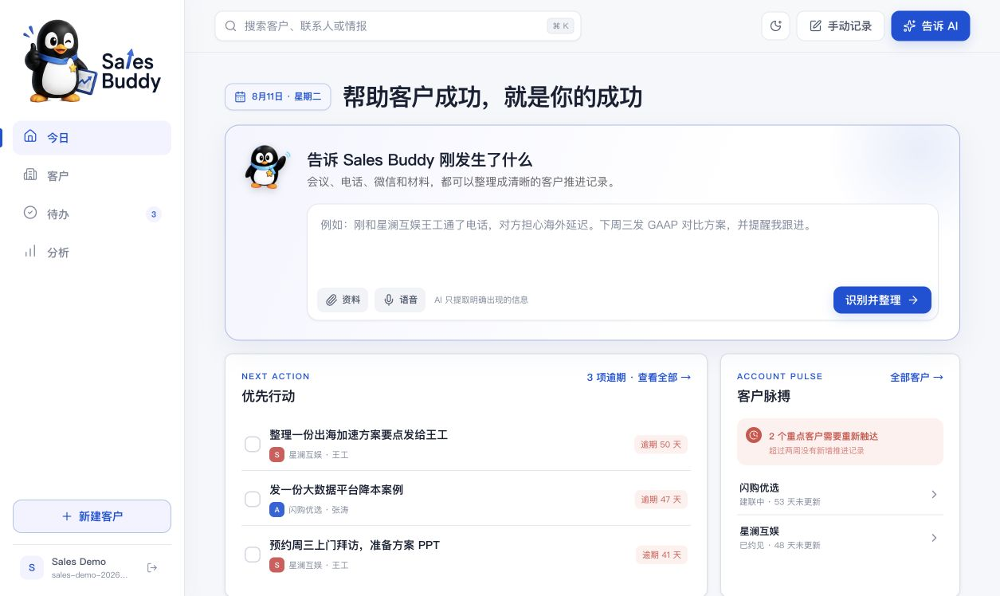
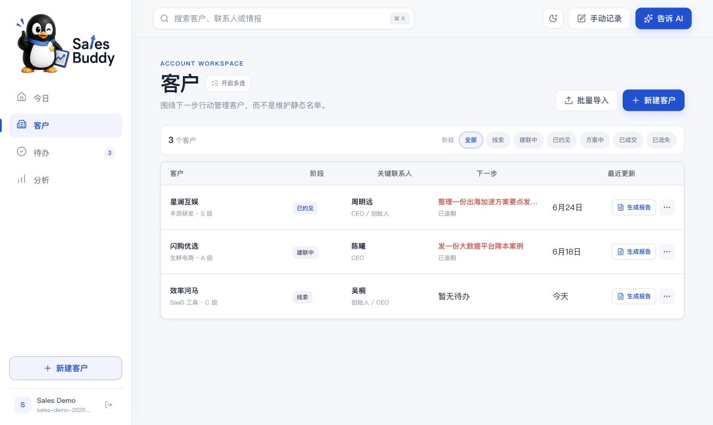
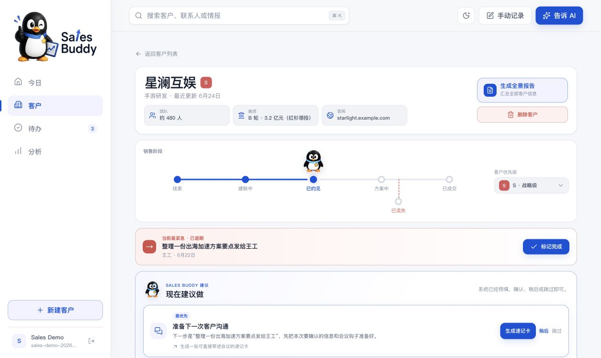
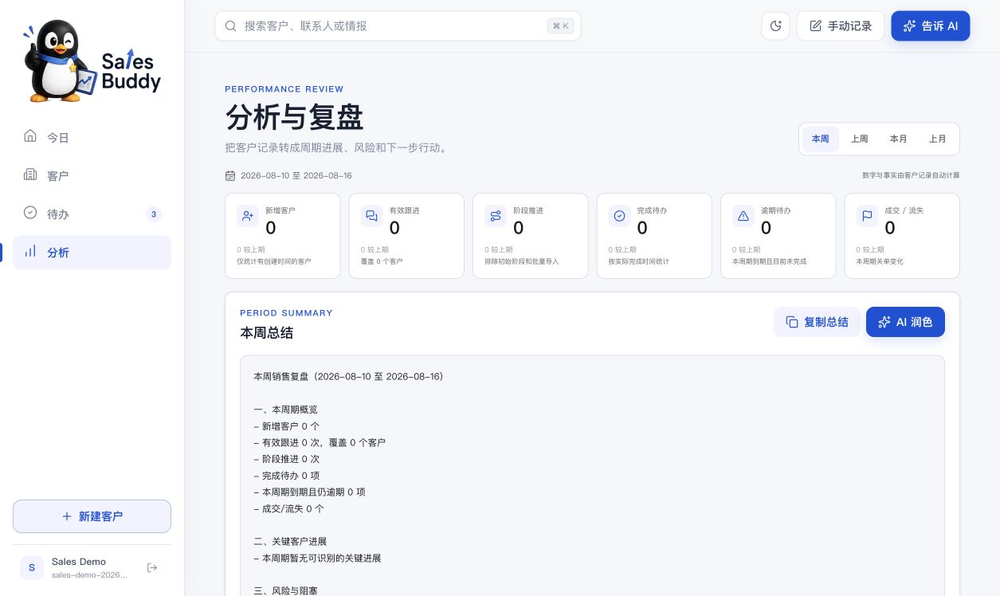
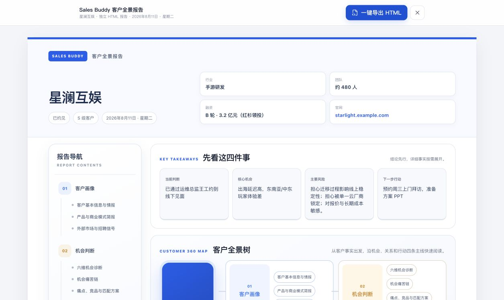

  

  <h1>你的 AI 销售搭档</h1>

  
<strong>从找客户、做调研，到跟进推进和客户汇报，一句话开始。</strong>

---

## 🚀 Sales Buddy 能做什么

你只需要告诉它一个销售目标，例如：

> 帮我找一批适合腾讯云的 AI 视频行业客户。

Sales Buddy 会陪你走完整条销售链路：

它不是替你做决定，而是把分散、重复的销售工作整理好，让你把时间放在客户沟通和推进上。

## ✨ 一次完整使用体验

### 1. 找到值得联系的客户

告诉 Sales Buddy 你想找什么行业、什么类型的企业。商机雷达会整理潜在客户、近期信号、推荐理由和需要进一步确认的问题。

你得到的不是一张只有公司名称的名单，而是一份“为什么值得跟、应该从哪里切入”的客户清单。

### 2. 把重点客户研究透

选中一家值得深入跟进的企业，客户透镜会继续梳理它的业务、产品、组织、近期动态、潜在需求和风险。

公开信息和仍需确认的判断会被分开呈现，方便你带着问题去见客户，而不是把猜测当成事实。

### 3. 把研究结果带进 CRM

客户资料可以直接进入 Sales Buddy 工作台，不需要重新复制整理。你可以继续维护客户阶段、优先级、关键联系人和下一步行动。

### 4. 记录每一次真实沟通

开完会、打完电话或聊完微信后，直接把发生的事情告诉 Sales Buddy。它会帮你整理关键信息、对接人、下一步和提醒日期，确认后再写入客户档案。

### 5. 推动客户向前走

Sales Buddy 会把客户资料转成具体动作，例如准备下一次会议、确认核心痛点、补齐决策链、制定双方计划或准备谈判材料。

### 6. 随时生成客户全景报告

当你需要内部汇报、协同方案或回顾客户时，可以一键生成完整报告。客户背景、机会、关系、进展、风险和下一步都来自同一份客户档案。

## 🖥️ 产品界面

  

🏠 打开 Sales Buddy，先看到今天最应该推进的事情

<table>
  <tr>
    <td width="50%">
      
      
📋 围绕下一步行动管理客户

    </td>
    <td width="50%">
      
      
🎯 在一个页面掌握客户全貌

    </td>
  </tr>
  <tr>
    <td width="50%">
      
      
📊 自动整理阶段成果与风险

    </td>
    <td width="50%">
      
      
🗺️ 一键形成可分享的客户报告

    </td>
  </tr>
</table>

## 🧭 日常使用的四个工作区

| 工作区 | 它会怎样帮助你 |
|---|---|
| **今日** | 告诉你今天优先推进谁、哪些任务已经逾期、哪些重点客户需要重新联系 |
| **客户** | 集中查看客户阶段、关键人、机会、沟通历史和下一步行动 |
| **待办** | 自动汇总所有客户的下一步，让承诺过的事情不再遗漏 |
| **分析** | 帮你回顾本周或本月的进展、风险和接下来应该关注的客户 |

## 🎯 客户作战空间

进入一家客户后，你可以围绕真实销售过程持续经营：

- 查看当前阶段、客户优先级和最紧急行动
- 准备下一次客户沟通，整理要问的问题和会议目标
- 记录客户明确表达的痛点，而不是只保存内部猜测
- 维护决策者、支持者、执行人及其关系
- 把外部动态转成需要向客户确认的问题
- 制定双方负责人和时间明确的联合行动计划
- 准备跟进邮件、会议议程、方案摘要和谈判材料
- 生成客户全景报告，方便内部协同和管理汇报

## 🛡️ Sales Buddy 的原则

**AI 是副驾，你拥有最终判断。** Sales Buddy 会提出建议和整理信息，但不会替你决定客户等级、关系状态、痛点或下一步。

**不知道的内容会保持未知。** 公开信息、销售判断和客户已经确认的事实会被区分开，避免让猜测污染客户档案。

**所有信息最终都要服务于行动。** 产品关注的不是“填了多少字段”，而是“下一步应该做什么”。

## 🎬 推荐演示方式

1. 说一句：“帮我找一批 XX 行业客户。”
2. 查看商机雷达整理出的潜在客户与推荐理由。
3. 选择一家企业继续进行客户深度研究。
4. 把客户资料导入工作台，查看完整客户档案。
5. 输入一次电话或会议结果，让 Sales Buddy 整理下一步。
6. 展示客户关系、会议准备和双方行动计划。
7. 一键生成客户全景报告。

---

  <strong>找客户 → 做研究 → 推进下一步 → 沉淀客户资产</strong>
   
  Sales Buddy，让每一次客户沟通都能推动事情向前走。

