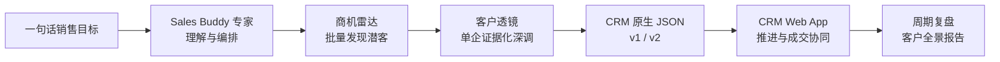

<div align="center">
  

  <h1>端到端 AI 销售作战系统</h1>

  <p><strong>从一句“帮我找 XX 行业客户”，到客户研究、CRM 推进与全景报告。</strong></p>

  <p>
    
    
    
    
  </p>
</div>

---

Sales Buddy 不是一个孤立的 CRM 页面，而是一条完整的销售工作流：WorkBuddy 中的专家理解目标并编排两个专业 Skill；Skill 生成可核验、可导入的客户数据；CRM Web App 接住研究结果，继续完成跟进、诊断、协同、复盘与报告输出。

## 🚀 一眼看懂



> **示例：**“帮我找一批适合腾讯云的 AI 视频行业客户。”<br>
> 系统可以把这句话逐步转成潜客清单、重点客户研究、CRM 客户档案、下一步行动和可分享报告。

## 🧩 产品组成

| 组件 | 角色 | 交付结果 |
|---|---|---|
| **Sales Buddy 专家** | WorkBuddy 中的流程入口与编排者 | 理解目标，选择找客或深调路径，衔接后续流程 |
| **商机雷达** | `enterprise-prospect-research` | 批量发现、核验和评分潜客；输出 JSON、Markdown、HTML |
| **客户透镜** | `enterprise-customer-deep-research` | 锁定企业主体并完成单客户深调；输出 JSON、Markdown、HTML |
| **CRM Web App** | 客户推进工作台 | 导入、分级、跟进、诊断、协同、复盘和全景报告 |

> WorkBuddy 专家运行在 WorkBuddy 中，不在本仓库内。本仓库包含 CRM Web App、两个 Skill 的源码与样例，以及它们之间的数据契约。

## 🖥️ CRM Web App

CRM 以“下一步行动”为中心，而不是以填写字段为中心。

| 工作区 | 关键能力 |
|---|---|
| **今日** | AI 信息收件箱、优先行动、逾期待办、重点客户脉搏 |
| **客户** | 客户筛选与分级、批量导入、客户作战空间、全景报告 |
| **任务** | 从跟进记录自动形成待办，支持逾期识别、完成与恢复 |
| **分析与复盘** | 周/月指标、关键进展、风险、下周期行动、规则总结与 AI 润色 |

### 当前产品界面

<p align="center">
  
</p>

<p align="center"><sub>🏠 今日工作台：AI 信息收件箱、优先行动与客户脉搏</sub></p>

<table>
  <tr>
    <td width="50%">
      
      <p align="center"><sub>📋 客户工作区</sub></p>
    </td>
    <td width="50%">
      
      <p align="center"><sub>🎯 单客户作战空间</sub></p>
    </td>
  </tr>
  <tr>
    <td width="50%">
      
      <p align="center"><sub>📊 分析与复盘</sub></p>
    </td>
    <td width="50%">
      
      <p align="center"><sub>🗺️ 客户全景报告</sub></p>
    </td>
  </tr>
</table>

### 从研究到成交的客户作战空间

- **数据接入**：支持 `JSON / CSV / TSV / XLSX / XLS`，导入前逐条预览、校验和勾选；同名客户可跳过或更新。
- **AI 跟进记录**：理解会议、电话、微信等自然语言，可附材料或语音输入；候选字段经销售确认后写入。
- **机会判断**：六维机会诊断、业务简报、外部信号和“问题—影响—方案”痛苦链。
- **关键关系**：维护联系人层级、汇报关系、角色、联系方式与独立建联状态。
- **会前会后**：生成会前速记卡，记录会后结果、客户原话、确认事项和下一步。
- **成交协同**：联合工作计划、谈判助手与销售资产工作室。
- **全景报告**：按实际数据动态生成并导出独立、响应式、可转发的 HTML 报告。

<details>
<summary><strong>展开查看客户详情中的完整视图</strong></summary>

基础客户默认包含：

- 作战概览
- 情报与证据
- 推进记录
- 关键关系
- 外部信号
- 成交工具

导入带完整账户情报的 `crm-customer-list.v2` 后，会额外出现：

- 账户全景
- 腾讯机会
- 面客准备

</details>

<details>
<summary><strong>展开查看会前、谈判与销售资产能力</strong></summary>

- 会前速记卡：目标、假设、确认问题、异议准备、下一次会议钩子
- 会后确认：结果、客户原话、已确认事项、未决问题、下一步
- 谈判助手：目标、客户诉求、交换项、红线、异议、give-get 纪律
- 销售资产：跟进邮件、会议议程、方案摘要、内部协同 Brief、谈判作战卡等

</details>

## 🔭 两个 Skill

### 📡 商机雷达｜批量找到值得跟的客户

商机雷达把企业视为“待验证客户”，不会把公开线索直接包装成已经存在的采购需求。它围绕业务匹配、近期事件、招聘、招采和生态线索发现候选，并为结论保留来源、置信度、风险、未知项和下一步确认问题。

目录：[`获客Skill/enterprise-prospect-research/`](获客Skill/enterprise-prospect-research/)

### 🔍 客户透镜｜把一家企业研究透

客户透镜首先锁定正确的法定主体，避免混淆品牌、母公司、子公司和同名企业；随后研究公司、业务、公开组织、关键事件、招聘、招采、资质、风险与潜在机会，并明确区分事实、推断和待确认问题。

目录：[`调研Skill/enterprise-customer-deep-research/`](调研Skill/enterprise-customer-deep-research/)

## 🔗 数据如何安全贯通

| 数据阶段 | 可以写入 | 不允许假装已经发生 |
|---|---|---|
| **公开找客 / 深调** | 企业事实、来源、信号、评分、风险、待验证假设 | 已建联、已沟通、已确认痛点、双方计划、采购承诺 |
| **CRM 推进** | 真实沟通、关系状态、客户确认、任务、方案、谈判信息 | 未经销售确认的 AI 自动覆盖 |
| **全景报告** | 档案中已有的事实、判断、证据、进展与行动 | 为了版面完整而补写空字段 |

支持的数据契约：

- `crm-customer-list.v1`：基础 CRM 客户包，可承载获客结果和单客户深调快照。
- `crm-customer-list.v2`：增加完整账户全景情报，驱动账户全景、腾讯机会和面客准备视图。
- `company-deep-research.v1`：客户透镜内部的证据化研究快照。

Schema 位于 [`docs/integration/`](docs/integration/)。导入模块会校验版本、字段、来源元数据、主体一致性，以及公开研究不得越权写入的销售私有字段。

## 🛡️ 设计原则

1. **AI 是副驾，销售拥有最终判断。** AI 负责发现、抽取、整理和建议；客户等级、关系状态、痛点、方案与行动由销售确认。
2. **证据优先于看起来完整。** 没有可靠来源就保留未知；公开任职不等于已经建联；推断不会混入客户事实。
3. **下一步行动是 CRM 的中心。** 产品优先回答“今天联系谁、要确认什么、有什么风险、下一步怎么推进”。
4. **同一事实源贯穿全流程。** Skill、CRM、复盘与报告使用统一客户数据，减少重复整理和版本冲突。

## ⚙️ 本地运行

要求：Node.js 22 或更高版本。

```bash
cp .env.example .env
# 至少将 AUTH_SECRET 改成高强度随机值
npm start
```

打开 <http://127.0.0.1:3000>，注册后即可使用。Node 服务提供账号认证、按用户隔离的数据存储、revision 乐观锁和 AI 代理，默认数据目录为 `.data/`。

<details>
<summary><strong>可选：配置 OpenAI 兼容 AI 服务</strong></summary>

```bash
AI_API_URL=https://api.openai.com/v1
AI_API_KEY=your-api-key
AI_MODEL=your-model
```

`AI_API_URL` 可填写 API 根路径或完整的 `/chat/completions` 地址。密钥只保存在服务端，不会下发浏览器。AI 未配置时，基础记录提取和规则复盘仍可使用。

</details>

<details>
<summary><strong>可选：CloudBase 模式</strong></summary>

仓库保留 CloudBase 登录与同步适配。配置 `cloudbase-config.js` 后可启用云端模式；未配置时使用 Node 同源 API，纯静态打开则作为本地演示模式。

</details>

## ✅ 验证

```bash
npm run check
npm test
```

当前测试覆盖账号与数据隔离、AI API、两个 Skill 的 Schema 与质量门禁、客户导入、CRM 交互、报告、移动端和可访问性。

```text
167 tests · 167 passed · 0 failed
```

## 🎬 推荐 Demo 路径

1. 在 WorkBuddy 中说：“帮我找一批 XX 行业客户。”
2. 查看商机雷达生成的潜客清单与 CRM JSON。
3. 对其中一家调用客户透镜，生成单客户证据化研究。
4. 把 JSON 导入 CRM，查看账户全景、腾讯机会和面客准备。
5. 用自然语言记录一次客户沟通，确认 AI 提取结果并生成待办。
6. 完善决策链、痛点、联合计划和谈判策略。
7. 导出客户全景 HTML 报告，并在分析页生成周期复盘。

---

<div align="center">
  <strong>找客 → 研究 → 推进 → 成交协同 → 复盘</strong>
  <br />
  <sub>Sales Buddy 把这些原本割裂的工作，连接成同一条销售数据链。</sub>
</div>
